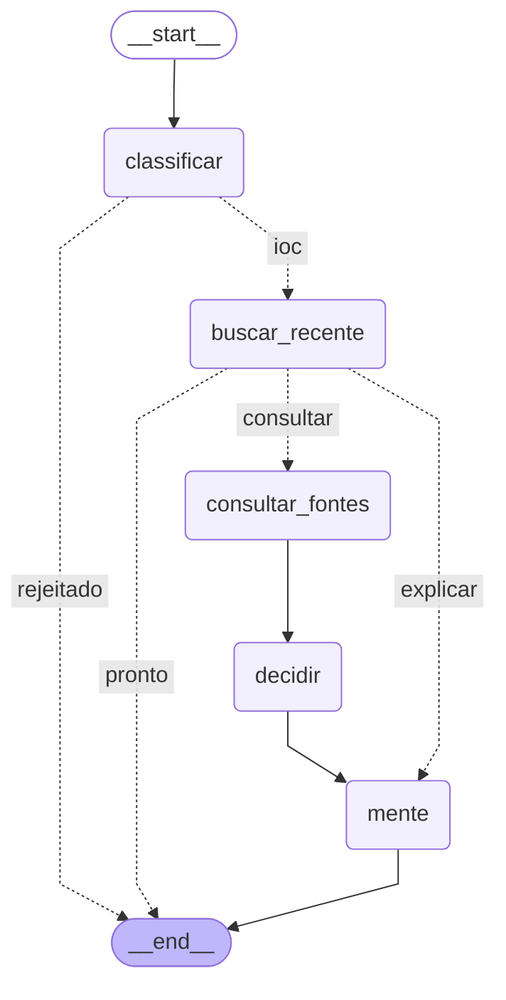

# Inóxio

Investigador de indicadores suspeitos. Você cola um IP, um domínio ou o hash de
um arquivo e recebe um veredito calculado por regra fixa a partir do VirusTotal
e do AbuseIPDB, com uma explicação em português escrita por uma IA que não
decide nada.

> *innoxius* (lat.): inofensivo. O veredito diz se o artefato é *noxius* ou
> *innoxius*.

Projeto da disciplina **Projeto Aplicado: Práticas de Mercado**
([escopo](https://github.com/ziraldocardoso/Projeto_aplicado-praticas_de_mercado/blob/main/Escopo_e_elementos_obrigatorios.md)).
Este README é o relatório técnico da entrega.

No ar em <https://179.199.133.136>.

## Como funciona

<!-- Gerado por `uv run python -m inoxio.agente.desenhar`; um teste falha se divergir do grafo. -->
<!-- grafo:inicio -->

<!-- grafo:fim -->

- **Classificar:** a entrada só segue se for IP público, hash MD5/SHA-1/SHA-256
  ou domínio, ou o endereço de uma página (`https://exemplo.com/pagina`). O
  formato desarmado (`hxxps://exemplo[.]com`) também é aceito. O resto é recusado
  sem consultar nada.
- **Reaproveitar:** o mesmo indicador investigado há menos de 24 h devolve o
  resultado salvo, sem gastar a cota das fontes nem da IA. Resultado em que
  alguma fonte falhou nunca é reaproveitado.
- **Consultar e decidir:** VirusTotal e AbuseIPDB em paralelo. Para o endereço de
  uma página, o VirusTotal é consultado pela URL e pelo domínio dela, e vale o mais
  grave dos dois; a URL só é consultada, nunca enviada para análise. No VirusTotal,
  motores que marcam o indicador como *malicious* ou *suspicious* somam para
  `suspeito`; só os *malicious* (5 ou mais) levam a `malicioso`. Para um
  domínio, o DNS dá até dois IPs públicos, e o AbuseIPDB diz a reputação de cada
  um. Isso é só contexto: sites grandes ficam atrás de CDN, onde um IP serve
  milhares de domínios, então a fama do IP não entra no veredito. O servidor só
  consulta o DNS, nunca se conecta ao site. O veredito
  (`malicioso`, `suspeito`, `sem_evidencia`, `desconhecido` ou `inconclusivo`) e
  a nota de risco (0 a 100: a partir de 25 é suspeito, a partir de 75 é
  malicioso) saem de regras fixas em `src/inoxio/agente/decidir.py`. Se
  uma fonte falha, o resultado é `inconclusivo`, nunca "sem evidência".
- **Mente:** um LLM no Groq lê os resultados e devolve resumo, técnicas MITRE
  ATT&CK e recomendações num esquema fixo. Ele não tem ferramentas e o esquema
  não tem campo de veredito. Se o Groq falhar ou demorar mais de 10 s, a tela
  mostra o resultado sem a análise.

## Telas

- **Login**, com usuário e senha.
- **Painel:** campo para investigar e a lista das últimas investigações do usuário.
- **Investigação:** veredito com a nota num medidor, as evidências de cada fonte e
  a análise da IA, com links para as técnicas do MITRE ATT&CK.
- **Usuários:** só para o papel `admin`, que cadastra, edita (papel e senha),
  desativa e reativa usuários por ali. O cadastro também existe no terminal, com
  `inoxio criar-usuario`. Ninguém desativa a própria conta, e o último admin
  ativo não perde o papel.

## Stack

FastAPI + LangGraph (Python 3.12) na API, React 19 + Ant Design 6 no frontend,
SQLite com SQLAlchemy, Groq (`openai/gpt-oss-20b`) para a IA.

```
src/inoxio/
  agente/      classificação, fontes, regras do veredito, IA e o grafo
  seguranca/   senhas, sessões e limites de uso
  web/         rotas da API, dependências de acesso e entrega do React
frontend/src/  telas de login, painel e investigação
infra/         Nginx da borda, Fail2Ban, Certbot e o script de deploy
tests/         testes do backend (pytest)
```

## OWASP Top 10:2025

Os três itens escolhidos, onde cada controle está no código e o teste que
falha se ele for removido.

### A01 Broken Access Control

| Controle | Onde | Teste |
| --- | --- | --- |
| Toda rota da API, fora login e sessão, exige sessão válida | `sessao_atual` em `src/inoxio/web/dependencias.py` | `test_autenticacao.py::test_rotas_protegidas_sem_sessao_sao_401` |
| Cada usuário só lista as próprias investigações; abrir a de outro responde 404, sem revelar que ela existe. Só o papel `admin` abre qualquer uma | `listar` e `ver` em `src/inoxio/web/agente.py` | `test_web_agente.py::test_lista_so_as_investigacoes_do_proprio_usuario`, `::test_investigacao_de_outro_usuario_e_404`, `::test_admin_ve_investigacao_de_qualquer_um` |
| Cadastro e lista de usuários só para o papel `admin`, que nunca vê o hash das senhas | `exigir_admin` em `src/inoxio/web/dependencias.py`; `src/inoxio/web/usuarios.py` | `test_usuarios.py::test_analista_nao_lista_nem_cadastra`, `::test_admin_lista_sem_expor_hash` |
| Escrita exige o token CSRF da sessão no cabeçalho `X-CSRF-Token`, comparado em tempo constante | `conferir_csrf` em `src/inoxio/web/dependencias.py`; o frontend envia em `frontend/src/api.ts` | `test_web_agente.py::test_post_sem_csrf_e_recusado`, `test_autenticacao.py::test_logout_sem_csrf_e_recusado` |
| A API só aceita corpo JSON, o que barra formulário vindo de outro site | modelos Pydantic em `src/inoxio/web/autenticacao.py` | `test_autenticacao.py::test_login_por_formulario_e_recusado` |

### A05 Injection

| Controle | Onde | Teste |
| --- | --- | --- |
| A entrada é validada por tipo (IP público, hash, domínio) antes de qualquer uso; o valor usado nas consultas é o normalizado, sem zona IPv6 (`%...`) nem IPv4 embutido em NAT64; de um endereço de site sai só o host, e só de `http`/`https` | `classificar_entrada` em `src/inoxio/agente/classificar.py` | `test_classificar.py::test_entradas_recusadas`, `test_grafo.py::test_argumento_da_consulta_vem_do_classificar` |
| SQL só por SQLAlchemy, sempre parametrizado; não há SQL montado com texto em `src/` | `src/inoxio/db.py` e as consultas em `src/inoxio/web/` | `test_grafo.py::test_entrada_rejeitada_nao_consulta_nada` (a entrada `' OR 1=1--` é recusada antes do banco) |
| O app não executa processo nem shell | todo `src/inoxio/` | `test_arquitetura.py::test_nenhum_argumento_shell`, `::test_app_nao_executa_processo` |
| O React nunca injeta HTML, e a CSP só aceita script próprio e estilo com nonce novo a cada resposta | `src/inoxio/web/spa.py`, `frontend/src/main.tsx` | `test_arquitetura.py::test_frontend_nunca_injeta_html`, `test_cabecalhos.py::test_pagina_do_react_leva_nonce_novo_no_cabecalho_e_na_meta` |
| Texto vindo das fontes vai para a IA marcado como não confiável; a IA não tem ferramentas e não decide o veredito | `src/inoxio/agente/mente.py`, `src/inoxio/agente/decidir.py` | `test_grafo.py::test_injecao_nas_tags_nao_muda_o_veredito`, `test_arquitetura.py::test_mente_nao_tem_tools_nem_campo_de_veredito` |

### A07 Authentication Failures

| Controle | Onde | Teste |
| --- | --- | --- |
| Senhas com argon2id, mínimo de 12 caracteres | `src/inoxio/seguranca/senhas.py` | `test_senhas.py::test_hash_e_argon2id`, `::test_senha_curta_e_recusada` |
| Usuário inexistente e senha errada dão a mesma resposta; o inexistente também passa pelo argon2, para o tempo não denunciar quem existe | `_HASH_FALSO` em `senhas.py`; `entrar` em `src/inoxio/web/autenticacao.py` | `test_autenticacao.py::test_usuario_inexistente_e_senha_errada_respondem_igual` |
| Bloqueio de 15 min após 5 falhas da mesma conta vindas do mesmo IP, ou 20 falhas de um IP em qualquer conta (IPv6 conta pela rede /64); senhas erradas de outro IP não trancam o dono, até o teto de 100 falhas da conta somando todos os IPs; tentativas em paralelo não furam o limite; um `X-Forwarded-For` forjado não troca o IP | `src/inoxio/seguranca/limites.py`; `entrar` em `src/inoxio/web/autenticacao.py`; `ProxyHeadersMiddleware` em `src/inoxio/web/app.py` | `test_limites_login.py` |
| Sessão no servidor: o banco guarda só o SHA-256 do token; cookie `__Host-`, `HttpOnly`, `Secure`, `SameSite=Strict` | `src/inoxio/seguranca/sessoes.py` | `test_autenticacao.py::test_banco_guarda_so_o_hash_do_token`, `::test_cookie_de_sessao_protegido` |
| Conta desativada não entra (mesma resposta de senha errada) e perde as sessões abertas; senha trocada pelo admin também derruba as sessões | `alterar` em `src/inoxio/usuarios.py`; `validar` em `src/inoxio/seguranca/sessoes.py` | `test_usuarios.py::test_desativado_nao_entra_e_perde_a_sessao_aberta`, `::test_senha_nova_derruba_as_sessoes_e_so_ela_vale` |
| Token novo a cada login, expiração por 30 min de inatividade ou 8 h de duração, logout que apaga a sessão no servidor | `sessoes.py`; `entrar` e `sair` em `autenticacao.py` | `test_autenticacao.py::test_login_troca_o_token_e_fecha_o_antigo`, `::test_sessao_ociosa_expira`, `::test_logout_invalida_no_servidor` |

Além dos três, o código também trata A10 (Mishandling of Exceptional
Conditions: falha de fonte vira `inconclusivo`, e erro 500 não mostra stack
trace) e A03 (Software Supply Chain Failures: dependências travadas em
`uv.lock` e `package-lock.json`, `npm ci --ignore-scripts` e Actions fixadas por
SHA).

## Infraestrutura

VPS na Hostinger com Ubuntu Server 24.04.4 LTS.

- **Borda:** Nginx 1.30 (`infra/borda/`) nas portas 80 e 443. A porta 80 só
  atende o desafio do Let's Encrypt e redireciona o resto para HTTPS com `301`.
  Na 443, o Nginx lê o nome pedido no TLS sem abrir a conexão: o acesso pelo IP
  é terminado nele e repassado ao app; qualquer outro nome segue para o outro
  sistema da máquina.
- **Limite de requisições:** a borda aceita até 10 requisições por segundo por
  IP (com folga de 40) e 10 tentativas de login por minuto (folga de 5). Acima
  disso responde `429` em JSON, antes de chegar ao app.
- **TLS:** TLS 1.3 e 1.2, com troca de chaves pós-quântica `X25519MLKEM768`
  como preferida. Certificado do Let's Encrypt emitido para o IP, no perfil de
  curta duração (cerca de 6 dias).
- **Certbot:** versão 5.8, instalada por pip em `/opt/certbot` porque a VPS não
  tem snap. A renovação roda duas vezes por dia pelo timer
  `infra/certbot/certbot-renova.timer`; o `certbot renew --dry-run` passou.
- **SSH:** só por chave (`PasswordAuthentication no`). Fail2Ban na porta 22 com 4
  erros e banimento de 24 h (`infra/fail2ban/sshd.local`).
- **Firewall:** UFW negando toda entrada por padrão; abertas só a 22, a 80 e a
  443 (mais a do outro sistema, ver os desvios).
- **App:** uvicorn ouvindo só em `127.0.0.1:8100`, rodando como o usuário
  `inoxio`, sem `sudo` nem `docker`, numa unidade `systemctl --user` com
  `NoNewPrivileges` (`infra/implantacao/inoxio.service`). As chaves das APIs
  ficam em `~/.config/inoxio/env`, com modo 600, fora do repositório.

Resultado dos testes de TLS, feitos em 26/09/2026 no endereço `179.199.133.136`:

- [SSL.org](https://www.ssl.org/): *Certificate Trusted: Yes*; *sha384 / EC 256 bits ·
  Good signature · Good key* (o escopo pede pelo menos *Acceptable key*).
- [DigiCert PQC checker](https://www.digicert.com/pqc-checker): *Pass*, com TLS 1.3 e
  troca de chaves ML-KEM (`X25519MLKEM768`).

## Deploy

Cada `git push origin main` dispara `.github/workflows/implantar.yml`:

1. **testar:** `ruff`, `pytest`, os testes do React (`vitest`) e o build.
2. **implantar:** só roda se o primeiro passar. Compila o frontend e manda o
   pacote por SSH para a VPS, junto com o SHA do commit.

Na VPS, a chave do CI está presa a um único comando no `authorized_keys`
(`restrict,command="/home/inoxio/bin/implantar"`): ela não abre shell nem túnel.
O script `infra/implantacao/implantar` recusa o que não for um SHA de 40
hexadecimais e o pacote que tiver link, arquivo especial ou mais de 100 MB
descompactado, faz o checkout do commit, instala as
dependências com `uv sync --frozen`, troca o frontend, reinicia o serviço e
confere o `/saude`. Se o app não responder, volta para a versão anterior.

A chave privada e o `known_hosts` ficam nos Secrets do environment `producao`
(`INOXIO_SSH_KEY`, `INOXIO_SSH_KNOWN_HOSTS`). O workflow tem permissão só de
leitura no repositório e usa as Actions fixadas por SHA.

## Conta e repositório

- Conta GitHub gratuita com 2FA; `commit` e `push` por chave SSH.
- Repositório público com *secret scanning* e *push protection* ligados.
- O `.gitignore` bloqueia `.env`, chaves, certificados e bancos locais. O
  modelo das variáveis está em `.env.example`, sem nenhum valor.

## Rodando localmente

Precisa de Python 3.12 com [uv](https://docs.astral.sh/uv/) e Node 22.

```bash
uv sync
cp .env.example .env        # preencha as três chaves
uv run inoxio criar-usuario seu_nome --papel admin
(cd frontend && npm ci && npm run build)
uv run --env-file .env uvicorn inoxio.web.app:criar_app --factory
```

O app abre em <http://127.0.0.1:8000>. Sem as chaves ele funciona, mas toda
investigação sai `inconclusivo`. Para mexer no frontend com recarga automática,
rode `npm run dev` em `frontend/`: o Vite repassa `/api` para o uvicorn.

Testes: `uv run pytest` e, em `frontend/`, `npm test`.

## Uso de IA

Como pede o escopo, o desenvolvimento e a auditoria do código usaram IA: o
**Claude Code**, no lugar do Google Antigravity recomendado, para escrever e
revisar o código e a segurança.

## Desvios declarados

- **Free Tier:** a aplicação roda numa VPS paga que já existia, compartilhada
  com outro sistema do autor, e não num nível gratuito de nuvem. O Nginx da
  borda separa o tráfego dos dois pelo nome pedido na conexão TLS.
- **Versão do sistema:** a VPS usa o Ubuntu Server 24.04.4 LTS, que é a versão
  em que ela já estava, e não a LTS mais recente.
- **Porta de outro sistema:** há uma porta UDP aberta na mesma máquina que
  pertence a esse outro sistema. O Inóxio expõe só a 80 e a 443, além da 22.
